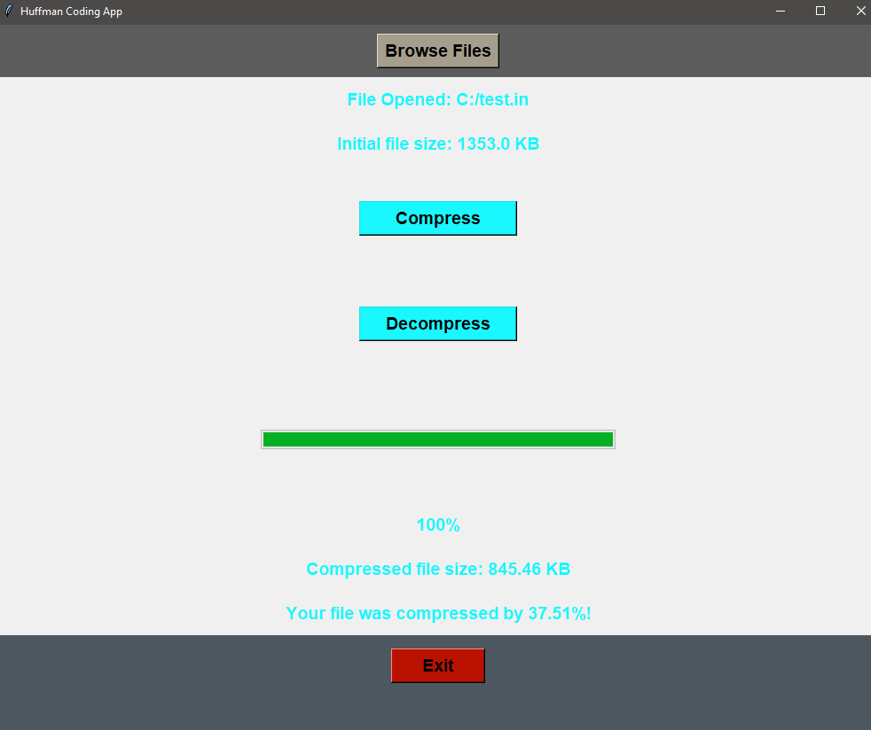

# Huffman-Coding-App
A desktop app to demonstrate Huffman Coding, a lossless data compression algorithm. Files can be compressed and decompressed within the GUI. Written in C++ and Python.

## Compiling

To run this project, you will need to compile huffman.cpp with the following command:

`g++ -shared -o libhuffman.dll huffman.cpp`
